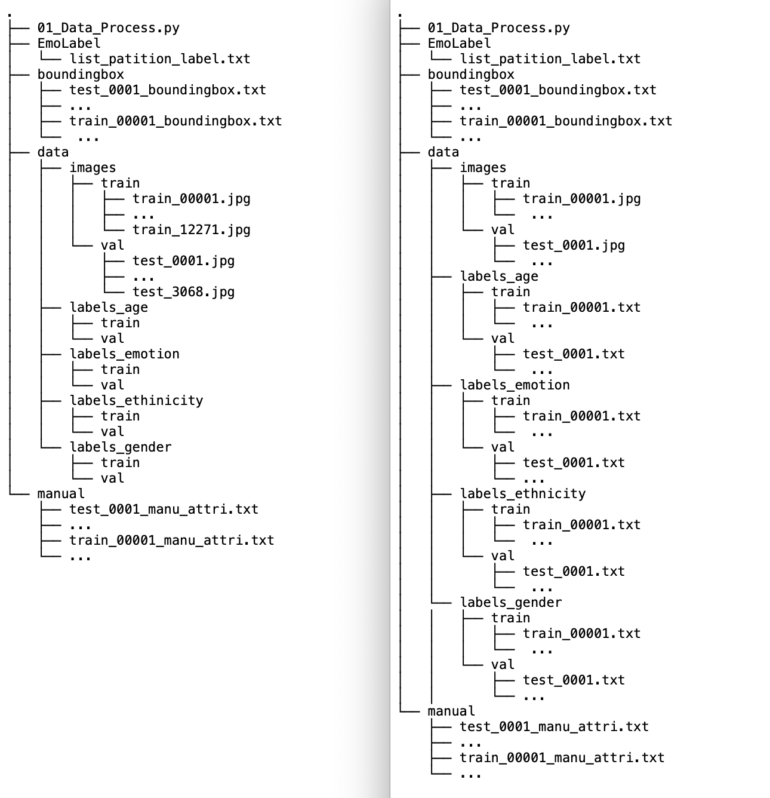
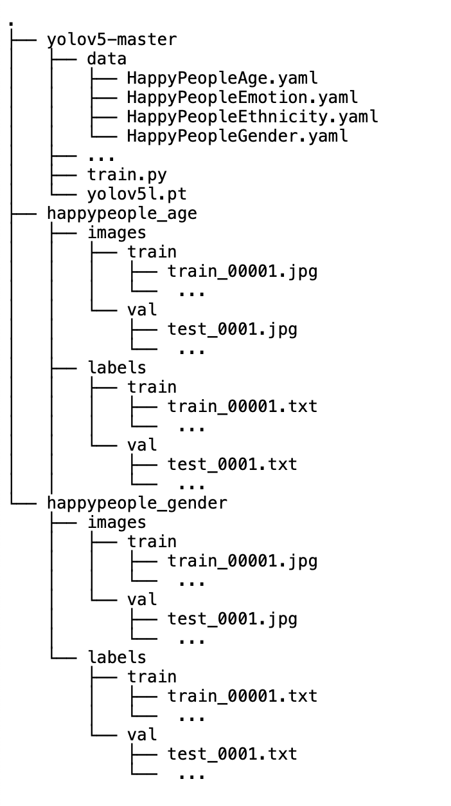

# YOLOv5 model training steps

## Data source
The training data from this project is the [**Real-world Affective Faces Database**](http://www.whdeng.cn/raf/model1.html). To get access to the data, please contact the original authors.

## YOLOv5 Model
The YOLOv5 model used in this project is the [**framework**](https://github.com/ultralytics/yolov5) developed by the **Ultralytics** team. The framework is still under develop during the time of this project. The version we have used in this project is v5.0. Adjustment may be required if you want to use a later version. You can also find the YOLOv5 model on the official website of PyTorch.

## Data Preprocess
In order to use the [**Real-world Affective Faces Database**](http://www.whdeng.cn/raf/model1.html) to train a YOLOv5 model from this [**framework**](https://github.com/ultralytics/yolov5), one has to convert the data into the ["COCO" format](https://cocodataset.org/#home). In particular for the this YOLOv5 framework, each label is a .txt file containing a numeric output, representing the corresponding class label, and 4 numberic value representing the 0-index bounding box coordinates. 

Please find all the corresponding data (including images, bounding box data, emotion label data, attribution data) from the  [**Real-world Affective Faces Database**](http://www.whdeng.cn/raf/model1.html) and place them in the following folders inside the "Data_Preprocess" folder.

Then run the python program
```console
python 01_Data_Process.py
```


The program will extract the corresponding label .txt files for each of the four outputs. 

 


## Training Config
The training process requires a config file written in .yaml format for specifying the directory of the data and the categories of the target output.  We recommend placing the data outside of the main YOLOv5 folder and place the .yaml file in the "data" folder inside the main YOLOv5 folder. 

For each model, copy the image train and val folders from the previous "Data Preprocess" step into the image folder, and the label train and val folders into the corresponding labal folder
e.g.,


## Training 
After placing all the data in the correct folder, you are good to go with the training commands.

Install required package
```console
pip install -qr requirements.txt
```

Run on single GPU (example)
```console
python train.py --img 640 --batch 32 --epochs 200 --data HappyPeopleGender.yaml --weights yolov5s.pt --cache
```

Run on multiple GPUs (example)
```console
python -m torch.distributed.launch --nproc_per_node 2 train.py --img 640 --batch 32 --epochs 150 --data HappyPeopleGender.yaml --weights yolov5l.pt --device 0,1
```

