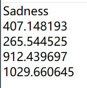

## This part code may help you build the XML format data for SSD training
# The above four python code can help you make the txt file. 
The txt file can be used to make the XML format data that can be used by SSD.  

#The txt file format shows below:  

 
Then you can use the xml+make.py to make the XML format data for training.  

# The XML file format shows below:  

